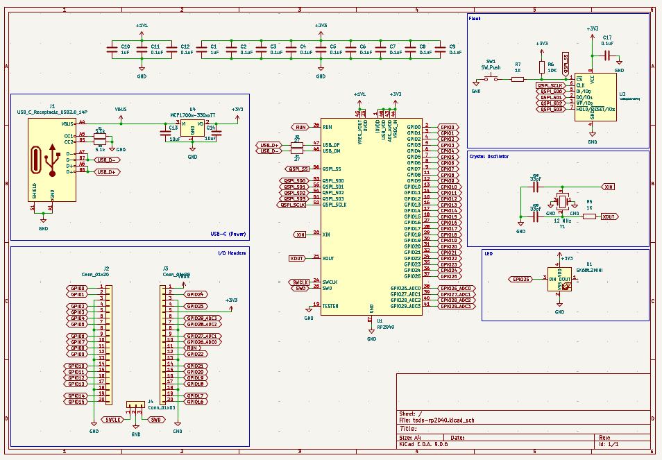
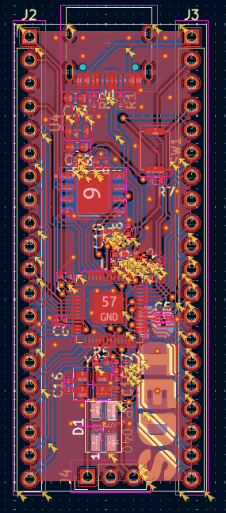
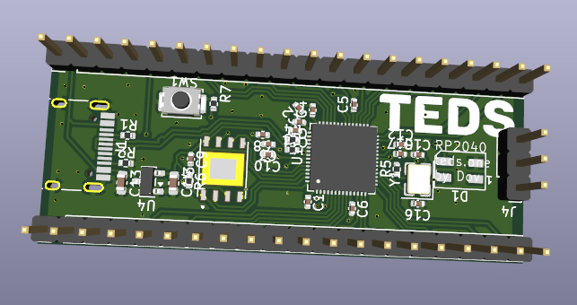

# TEDS RP2040

an rp2040 devboard. GPIO pinouts should be the same as / similar to the pi pico, with a few extra pins  
there is also an LED which could be used as a status indicator  

routing the PCB was a pain... especially since the footprint for the flash was bigger than the easy EasyRP2040 guide  
both usb routes are the same distance like required  

Schematic            |  PCB         |   PCB (3d)
:-------------------------:|:-------------------------:|:-------------------------:|
    |    | 